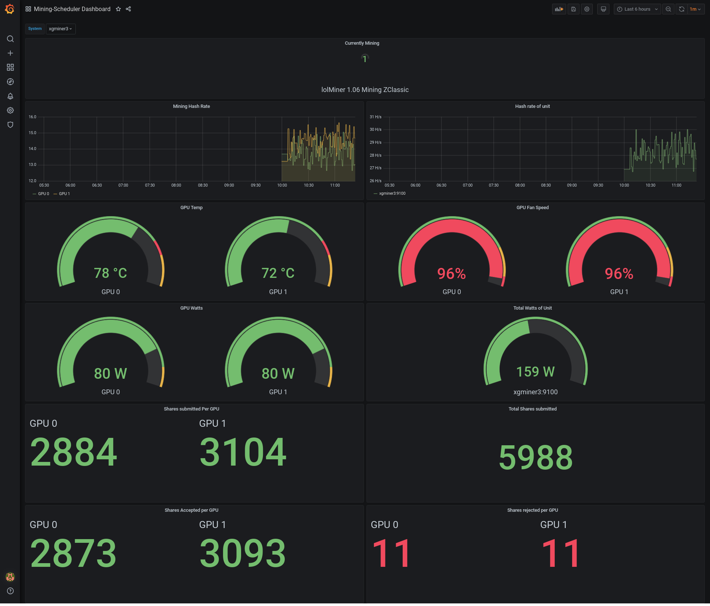

This is the space for the new mining-scheduler-exporter. 

It collects stats from the miner and uses node_exporter to export those stats to prometheus.
This way you can graph your data using Grafana.

The file mining-scheduler-exporter.dashboard.json is my test dashboard for Grafana.

Im currently working on building it and the plugins to pull the stats from the miners API's

Notes: The plugins for the stats collector look to the hostname localhost (127.0.0.1) and a port. 
       The default ports are

 * lolminer api port 9144
 * phoenixminer api port 3333
 * claymore api port 3333
 * teamredminer api port 4028
 * sgminer api port 4028
 * nsgminer api port 4028
 * nbminer api port 4028
 * bminer api port 1880
 * xmrig api port 4028

If you wish to change the port on any of the plugins you can edit the plugin.pm file and search for $url. It will containe the address:port entry.

There is a stats plugin called none.pm, this one returns 0 on all stats and is used for unsupported miners and miners without an api.

Note: Not all API's return all the data. As such some miners will return a 0 for wattage and fan speed. xmrig does not have wattage, fan speed, or per-gpu share stats.

 
